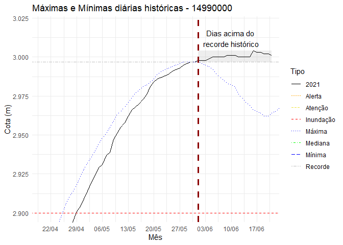

<!-- README.md is generated from README.Rmd. Please edit that file -->

# Trabalho Final de Faxina de Dados do Théo (tffdt)

<!-- badges: start -->

[](https://github.com/theoadepaula/tffdt/actions)

<!-- badges: end -->

O propósito da criação do pacote é para a entrega final do curso Faxina
de Dados. O trabalho foi feito em cima de pedido feito por um colega de
trabalho para acompanhar o nível de água do município de Manaus.

Para a cumprir o objetivo desse trabalho ,foram trabalhados os dados
telemétricos de uma estação que está instalada no Rio Negro, com o
código 14990000, que se encontra perto de Manaus. Pelas reportagens
noticiadas na TV e na internet, podemos observar a preocupação da
população local com o nível da água, pois não só atrapalha a rotina da
cidade como existem pessoas que perdem roupas, móveis, automóveis e até
casas.

## Análise dos dados

Os dados foram baixados de dois lugares no site de [dados de telemetria
da ANA (Agência Nacional de Águas e Saneamento
Básico)](http://telemetriaws1.ana.gov.br/EstacoesTelemetricas.aspx),
sendo uma parte dos dados vindos da Série Histórica da Região e outra
dos dados vindos do ano de 2021.

## Limpeza de dados

Para fazer uma análise adequada, é preciso primeiro fazer uma limpeza
nos dados baixados/recebidos. As variáveis a serem analisadas é data da
medição e o nível de água/cota. Abaixo está como foi feito a limpeza das
duas partes.

### Série Histórica

Dentro da Série Histórica, será necessário verificar a medição de cota.
A tabela bruta possui 78 colunas e é preciso primeiramente retirar as
variáveis que não tem interesse, já que a tabela bruta possui 78
variáveis e 2.854 observações. Algumas dessas colunas, como o status da
estação por dia, a máxima, mínima e média do mês observado, não serão
interessantes para o que foi proposto, podem portanto, serem retirados
da tabela final, após a limpeza.

Como os dados dos dias dos meses estão dispostos em colunas, é preciso
então colocar em formato longer para se adequar aos princípios
tidy.Depois foram feitas as transformações como colocar a variável
dataHora em formato datetime e Cota em formato númerico. As variáveis
citadas foram renomeadas para data\_hora e cota, respectivamente.

Depois foi preciso ordenar o banco de dados pelas colunas data\_hora e
nivel\_consistencia para retirar as informações duplicadas, dando
preferëncia aos dados de nível consistidos do que os dados brutos.

Abaixo está o código para pegar o dado bruto e o dado arrumado.

``` r
pegar_historico <- function(cod_estacao,
                            data_inicio='',
                            data_fim='',
                            tipo_dados,
                            nivel_consistencia) {

  url <- 'http://telemetriaws1.ana.gov.br/ServiceANA.asmx/HidroSerieHistorica?'

  dados_hidro <- GET(url,
                     query = list(
                       codEstacao=cod_estacao,
                       dataInicio=data_inicio,
                       dataFim= data_fim,
                       tipoDados=tipo_dados,
                       nivelConsistencia=nivel_consistencia
                     ))

  tabela_hidro <- content(dados_hidro,type='text') %>%
    XML::xmlParse(encoding = 'UTF-8') %>%
    getNodeSet('//SerieHistorica') %>%
    xmlToDataFrame() %>%
    tibble()

}

historico_total_manaus_bruto <-
  pegar_historico('14990000',tipo_dados = 1, nivel_consistencia = 1)

historico_total_manaus_consistido <-
  pegar_historico('14990000',tipo_dados = 1, nivel_consistencia = 2)

historico_bruto_total_manaus <-
  dplyr::bind_rows(historico_total_manaus_bruto,historico_total_manaus_consistido)

usethis::use_data(historico_bruto_total_manaus, overwrite = TRUE)

historico_total_manaus <-
  historico_bruto_total_manaus %>%
  dplyr::select(-ends_with('Status'),
         -DataIns,
         -EstacaoCodigo,
         -contains('Maxima'),
         -contains('Minima'),
         -contains('Media'),
         -TipoMedicaoCotas
  ) %>%
  tidyr::pivot_longer(starts_with('Cota'),
               names_to = 'dia_cota' ,
               values_to = 'nivel_cota') %>%
  janitor::clean_names() %>%
  dplyr::mutate(data_hora=lubridate::as_datetime(data_hora),
         dia_cota=stringr::str_remove(dia_cota,'Cota') %>% as.numeric(),
         nivel_cota=as.numeric(nivel_cota),
         data_hora= data_hora + lubridate::days(dia_cota-1),
         nivel_consistencia=as.numeric(nivel_consistencia)
  ) %>%
  dplyr::arrange(data_hora,desc(nivel_consistencia)) %>%
  dplyr::select(-dia_cota) %>%
  tidyr::drop_na(nivel_cota) %>%
  dplyr::distinct(data_hora,.keep_all = TRUE)
```

### Dados telemétricos

Para obter os dados de 2021, foi preciso fazer a função para baixar do
site. Para arrumar os dados, foi preciso transformar todos os dados em
branco em NA, transformar as variáveis Nivel,Vazao e Chuva em númericos
e DataHora em datetime.

``` r
pegar_dados <- function(nome_estacao,
                        data_inicio=format(floor_date( Sys.Date(),unit='years'),'%d/%m/%Y'),
                        data_fim=format(Sys.Date(),'%d/%m/%Y'))
{
  url <- 'http://telemetriaws1.ana.gov.br/ServiceANA.asmx/DadosHidrometeorologicos?'

  dados_hidro <- GET(url,
                     query = list(
                       codEstacao=nome_estacao,
                       dataInicio=data_inicio,
                       dataFim= data_fim
                     ))

  tabela_hidro <- content(dados_hidro,type='text') %>%
    XML::xmlParse(encoding = 'UTF-8') %>%
    getNodeSet('//DadosHidrometereologicos') %>%
    xmlToDataFrame() %>%
    tibble()
  
  dados_brutos_telemetria_manaus <- pegar_dados('14990000')

  dados_brutos_telemetria_manaus %>%
  janitor::clean_names() %>% # transforma os nomes das colunas
  dplyr::na_if('')%>% # Substitui o '' por NA
  dplyr::mutate(dplyr::across(c(nivel,chuva,vazao),as.numeric), # Transforma as variáveis em númericos
                data_hora = stringr::str_squish(data_hora) %>% # Transforma em datetime
                  lubridate::as_datetime())

  
```

Os dados, tanto brutos quanto arrumados, e as funções foram colocados
nesse pacote, que se chama ‘tffdt’ e está no
[GitHub](https://github.com/theoadepaula/tffdt). Pode ser baixado pelos
comandos abaixo:

``` r
# install.packages("devtools")
devtools::install_github("theoadepaula/tffdt")
```

## Análise dos dados arrumados

### Gráfico Mensal

Em uma primeira análise, foi feito um gráfico para observar os valores
mínimos, medianos e máximos de cada mês, além de acrescentar a linha de
cota máxima recorde (2997 cm). A série histórica possui valores desde
1902, e por questão de ver os dados sem influência das primeiras
coletas, foi descartado esse primeiro ano. Os dados foram agrupados por
mês, descartados os valores faltantes e mostrados apenas os valores
pedidos no primeiro parágrafo. Após retorno dos dados solicitados, a
tabela foi reorganizada para fazer o gráfico, de modo que os tipos de
valores (Mínima, Mediana, Máxima e Recorde) sejam aparecidos em uma
coluna e utilizados como grupo de cores no ggplot.

É possível observar que os valores máximos anuais se encontram nos meses
de maio e junho.

``` r
library(tffdt)

max_min_historica_mensal_manaus <-
  historico_total_manaus %>%
  filter(year(data_hora)>1903) %>%
  group_by(mes=month(data_hora)) %>%
  summarise(cota_max=max(nivel_cota),
            cota_min=min(nivel_cota),
            cota_med=median(nivel_cota)) %>%
  ungroup() %>%
  mutate(cota_recorde=max(cota_max))

max_min_historica_mensal_manaus %>%
  pivot_longer(starts_with('cota'),
               names_to = 'tipo',
               values_to = 'cota') %>%
  mutate(tipo=case_when(
    tipo=='cota_max' ~ 'Máxima',
    tipo=='cota_min' ~ 'Mínima',
    tipo=='cota_med' ~ 'Mediana',
    tipo=='cota_recorde' ~ 'Recorde'
  )) %>%
  ggplot(aes(factor(mes),cota,color=tipo,group=tipo))+
  geom_line()+
  geom_point()+
  #scale_y_discrete(labels=scales::comma)+
  labs(title = 'Máximas e Mínimas mensais históricas - 14990000',
       x='Mês',
       y='Cota (m)',
       color='Tipo')+
  theme_minimal()
```


### Gráfico Diário

Esse segundo gráfico é baseado nos dados agrupados por dia e mês. Agora
podemos ver não um ponto ao longo do mês, mas os pontos no decorrer dos
dias. Entre a segunda quinzena de maio e a segunda quinzena de junho é
observado historicamente o período com o maior nível de água na região.

``` r
max_min_historica_diaria_manaus <-
  historico_total_manaus %>%
  filter(year(data_hora)>1903) %>%
  group_by(mes=month(data_hora), dia=day(data_hora)) %>%
  summarise(cota_max=max(nivel_cota),
            cota_min=min(nivel_cota),
            cota_med=median(nivel_cota)) %>%
  ungroup() %>%
  mutate(cota_recorde=max(cota_max))

diaria_historico <- max_min_historica_diaria_manaus %>%
  pivot_longer(starts_with('cota'),
               names_to = 'tipo',
               values_to = 'cota') %>%
  mutate(tipo=case_when(
    tipo=='cota_max' ~ 'Máxima',
    tipo=='cota_min' ~ 'Mínima',
    tipo=='cota_med' ~ 'Mediana',
    tipo=='cota_recorde' ~ 'Recorde'  ),
    ano=2021
  ) %>%
  unite(data,dia,mes,ano,sep='/') %>%
  filter(data!='29/2/2021')%>%
  mutate(data=parse_date(data,format = '%d/%m/%Y'))

# Fazendo gráfico diário

diaria_historico%>%#filter(tipo=='Mediana') %>%
  ggplot(aes(data,cota,color=tipo,group=tipo))+
  geom_line()+
  geom_point()+
  scale_x_date(date_labels = '%d/%m',date_breaks = '45 days')+
  scale_y_continuous(labels = scales::comma_format(big.mark = '.',decimal.mark = ','))+
  labs(title = 'Máximas e Mínimas diárias históricas - 14990000',
       x='Mês',
       y='Cota (m)',
       color='Tipo')+
  theme_minimal()
```


Para entendermos como o ano de 2021 está em relação aos dados obtidos no
gráfico anterior, podemos acrescentar os dados de 2021. Para um melhor
entendimento do que se passa na região, foram linhas informando os
níveis de atenção (2700 cm), de alerta (2750 cm) e de inundação (2900
cm), fornecidos pela Defesa Civil do Estado. Os dados de 2021 são de
01/01/2021 até 13/06/2021.

Podemos ver que em 2021, o nível de água já ultrapassou o nível de
inundação e que parece ter ultrapassado até mesmo o recorde histórico da
região. Vamos dar um zoom no gráfico para ver melhor essa situação.

``` r
dados_telemetria_2021 <- dados_telemetria_manaus %>%
  filter(year(data_hora)==2021) %>%
  rename(cota=nivel) %>%
  mutate(data=as_date(data_hora)
  ) %>%
  select(data,cota) %>%
  group_by(data) %>%
  summarise(cota=max(cota,na.rm = T)) %>%
  ungroup() %>%
  drop_na(cota) %>%
  mutate(tipo='2021')

# Juntando os dados telemétricos com a série histórica, junto
# com as linhas de atenção, alerta, inundação e recorde

tabela_grafico <-bind_rows(diaria_historico,dados_telemetria_2021) %>%
  pivot_wider(data,names_from = tipo,values_from = cota,values_fill = NA) %>%
  mutate(Atenção=2700, Alerta=2750, Inundação=2900, Recorde=2997)%>%
  pivot_longer(-data,names_to = 'tipo', values_to = 'cota')

tabela_grafico %>% 
  filter(data==Sys.Date())
#> # A tibble: 8 x 3
#>   data       tipo       cota
#>   <date>     <chr>     <dbl>
#> 1 2021-06-21 Máxima     2964
#> 2 2021-06-21 Mínima     2163
#> 3 2021-06-21 Mediana    2811
#> 4 2021-06-21 Recorde    2997
#> 5 2021-06-21 2021       3001
#> 6 2021-06-21 Atenção    2700
#> 7 2021-06-21 Alerta     2750
#> 8 2021-06-21 Inundação  2900

g2021 <- tabela_grafico%>%
  ggplot(aes(data,cota,color=tipo,group=tipo,linetype=tipo))+
  geom_line()+
  # geom_line(. %>% filter(tipo=='2021'),size=2)+
  # geom_line(. %>% filter(tipo!='2021'),size=1.2)+
   scale_x_date(date_labels = '%d/%m',date_breaks = '1 month')+
  expand_limits(y=c(1000,3200))+
  scale_color_manual(values = c(
    '2021'='black',
    'Máxima'='blue',
    'Mínima' = 'blue',
    'Mediana' = 'green',
    'Alerta' = 'orange',
    'Atenção'= '#F0E442',
    'Inundação' = 'red',
    'Recorde' = 'gray'
  )
  )+
    scale_size_manual(breaks=c('2021','Máxima','Mínima','Mediana',
                               'Alerta','Atenção','Inundação','Recorde'),
                      values = c(1.5,1,1,1,1,1,1,1
  )
  )+
  scale_y_continuous(labels = scales::comma_format(big.mark = '.',
                                                   decimal.mark = ','))+
  labs(title = 'Máximas e Mínimas diárias históricas - 14990000',
       x='Mês',
       y='Cota (m)',
       color='Tipo',
       linetype='Tipo')+
  theme_minimal() 


g2021
```


Ao fazer o recorte do perído entre 20 de abril a 20 de julho, é possível
observar que desde o dia 29 de abril o nível de água está acima do nível
de inundação e que no dia primeiro de junho o nível de água está acima
do recorde histórico. Até a data informada (21/06/2021), o nível de água
está em 3001 cm ,acima de 2997 cm (recorde), e apresenta uma tendência
de queda. Chegou ao máximo nível de água, com 3004 cm, no dia 16 de
junho de 2021.

``` r
g2021 + 
  coord_cartesian(ylim = c(2900,3020),xlim = c(as_date('2021-04-20'),as_date('2021-06-20')))+
  scale_x_date(date_labels = '%d/%m',date_breaks = '7 days')+
  geom_vline(xintercept=tabela_grafico %>% filter(cota>2997) %>% slice(1) %>% pull(data),
             linetype='dashed', color='#8b0000',size=1.2)+
  annotate("rect", xmin = as_date('2021-06-01'), xmax = as_date('2021-06-21'), 
           ymin = 2997, ymax = 3004,  alpha = .1)+
  annotate("text", x = as_date('2021-06-10'), y = 3012,
           label='Dias acima do \nrecorde histórico')
```


